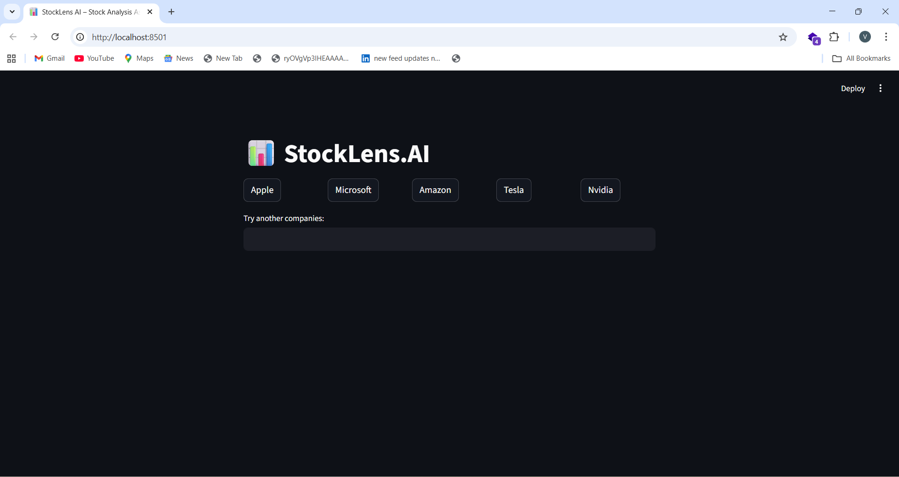

# 📊 StockLens.AI
AI-Powered Stock Analysis using Agentic AI (CrewAI + FastAPI + Streamlit)



## Overview
**StockLens.AI** is an **AI-driven stock analysis application** that provides structured insights such as stock price, market metrics, trade decisions (BUY / SELL / HOLD), recent news, and research-style summaries.

This project is built as a proof-of-concept to demonstrate:

- Agentic AI workflows using CrewAI
- Backend APIs using FastAPI
- Interactive frontend using Streamlit
- Real-time market data using Yahoo Finance

### ⚠️ Disclaimer:
This application is strictly for educational and demonstration purposes and must not be used for real trading or financial decisions.

## ✨ Features
- Real-time stock price & market capitalization
- Analyst rating insights
- Recent news summaries
- AI-generated trade decision (BUY / SELL / HOLD)
- Research-style stock analysis summary
- Modular agent-based architecture
- Clean REST API
- Interactive Streamlit UI

## 🧠 Architecture

```
User (Streamlit UI)
        ↓
FastAPI Backend (REST API)
        ↓
CrewAI Orchestration
 ├── Market Data Agent (Yahoo Finance)
 └── Stock Analysis Agent (LLM)
        ↓
Structured JSON Response
```

## 🗂️ Project Structure
```
Stock-Analyser/
│
├── ai_core/
│   ├── tools/
│   │  └── finance_tool.py
│   ├── agents.py
│   ├── tasks.py
|   └── crew.py
│
├── backend/
│   ├── main.py
│   └── api/
│       └── stock.py
│
├── config/
|   └── llm_settings.py
|
├── frontend/
│   └── streamlit_app.py
│
├── .env
├── requirements.txt
└── README.md
```

## ⚙️ Tech Stack

| Layer | Techgnology |
| --- | --- |
|Frontend | Streamlit|
|Backend |	FastAPI |
|AI Orchestration|	CrewAI|
|LLM Provider |	Groq / OpenRouter|
|Market Data |	Yahoo Finance|
|Config Management |	Pydantic Settings |
|Environment |	Python 3.10+|

## 🔑 Environment Variables (.env)
Create a ```.env``` file in the project root
```
API_KEY=your_llm_api_key_here
DEFAULT_LLM=groq/llama-3.3-70b-versatile
TEMPERATURE=0.2
```

## 📦 Installation
### 1️⃣ Create virtual environment
```
python -m venv myenv
myenv\Scripts\activate   # For Windows
```
### 2️⃣ Install dependencies
```
pip install -r requirements.txt
```

## Running the Application
### Start Backend (FastAPI)
```
cd backend
uvicorn main:app --reload
```
Backend runs at:
```
http://127.0.0.1:8000
```
API Docs:
```
http://127.0.0.1:8000/docs
```

## Start Frontend (Streamlit)
```
cd frontend
streamlit run streamlit_app.py
```
App runs at:
```
http://localhost:8501
```

## 🔌 API Endpoint
### Analyze Stock
#### POST ```/stocks/analyze```
Request
```
{
  "company": "Apple"
}
```
Response
```
{
  "stock_price": 192.35,
  "market_cap": 3000000000000,
  "week_52_high": 199.62,
  "week_52_low": 164.08,
  "analyst_rating": 2.1,
  "recent_news": [
    {
      "title": "Apple earnings beat estimates",
      "summary": "Apple reported strong quarterly results..."
    }
  ],
  "trade_decision": "HOLD",
  "explanation": "The stock is trading in the mid-range of its 52-week band...",
  "research_summary": "Apple continues to show stable performance...\n\nRisks include..."
}
```

## Error Handling
- Backend exceptions handled using FastAPI ```HTTPException```
- LLM rate-limit and token overflow managed via LLM factory
- Frontend displays user-friendly error messages

## 🧠 Why Agentic AI?
This project demonstrates:
- Separation of responsibilities across agents
- Tool-based reasoning
- Structured output using Pydantic
- Easy LLM swapping via configuration
- Scalable AI pipelines

## 🛣️ Future Enhancements
- 📊 Technical indicators (RSI, MACD, Moving Averages)
- 📉 Historical trend visualization
- 🔔 Alerts & watchlists
- 🧠 Multi-agent debate for decisions

## Author
**Vamshi Ramagoni**

🎓 BSc Computer Science (2024)

💼 Aspiring Data Scientist & AI Engineer
- GitHub:https://github.com/vamshigoud1108
- LinkedIn:https://linkedin.com/in/vamshi-ramagoni


